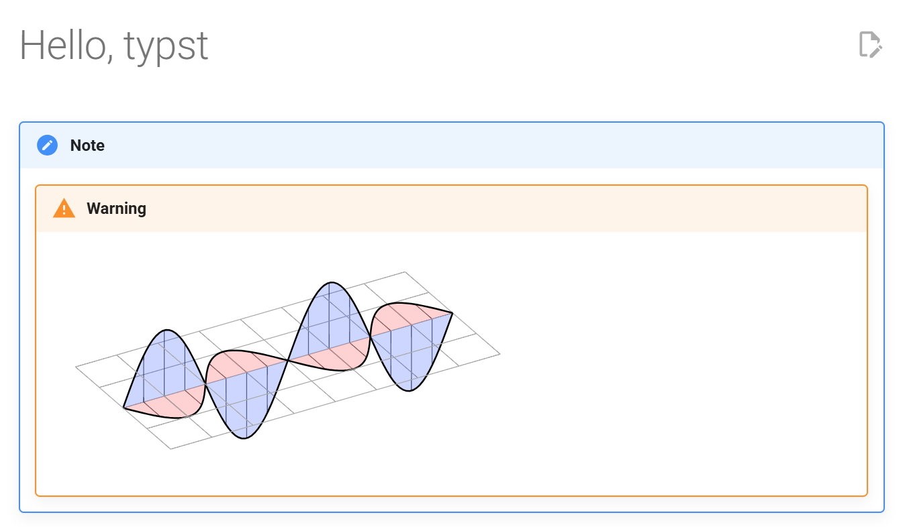

# python-markdown-typst

[](https://github.com/eWloYW8/python-markdown-typst/actions/workflows/release.yml)

A Python Markdown extension that compiles `typst` fenced code blocks into inline SVG images.

## Features

- Detects fenced code blocks labeled as `typst` with `typst-preview` in the first line.
- Compiles the Typst code into SVG format using the `typst` compiler.

## Installation

```bash
pip install markdown-typst
```

## Usage

````python
import markdown
from markdown_typst.typst_extension import TypstExtension

md = markdown.Markdown(extensions=[TypstExtension()])
input_text = '''

# This is a markdown title

```typst
// typst-preview
// This is a simple Typst document
= This is a typst title
```

'''

html = md.convert(input_text)
with open('output.html', 'w') as f:
    f.write(html)
````

### Integrate Typst Rendering with MkDocs

To enable Typst syntax rendering in MkDocs, add the following lines to your `mkdocs.yml`:

```yaml
markdown_extensions:
  - typst
```

#### Example Usage

````markdown
# Hello, typst

!!! note  
    !!! warning
        ```typst
        // typst-preview
        // Code from https://raw.githubusercontent.com/typst/packages/main/packages/preview/cetz/0.3.2/gallery/waves.typ
        #import "@preview/cetz:0.3.2": canvas, draw, vector, matrix
        
        #set page(width: auto, height: auto, margin: .5cm)
        
        #canvas({
          import draw: *
        
          ortho(y: -30deg, x: 30deg, {
            on-xz({
              grid((0,-2), (8,2), stroke: gray + .5pt)
            })
        
            // Draw a sine wave on the xy plane
            let wave(amplitude: 1, fill: none, phases: 2, scale: 8, samples: 100) = {
              line(..(for x in range(0, samples + 1) {
                let x = x / samples
                let p = (2 * phases * calc.pi) * x
                ((x * scale, calc.sin(p) * amplitude),)
              }), fill: fill)
        
              let subdivs = 8
              for phase in range(0, phases) {
                let x = phase / phases
                for div in range(1, subdivs + 1) {
                  let p = 2 * calc.pi * (div / subdivs)
                  let y = calc.sin(p) * amplitude
                  let x = x * scale + div / subdivs * scale / phases
                  line((x, 0), (x, y), stroke: rgb(0, 0, 0, 150) + .5pt)
                }
              }
            }
        
            on-xy({
              wave(amplitude: 1.6, fill: rgb(0, 0, 255, 50))
            })
            on-xz({
              wave(amplitude: 1, fill: rgb(255, 0, 0, 50))
            })
          })
        })
        ```
````



## Requirements

* `markdown`
* `typst`

## License

MIT License
